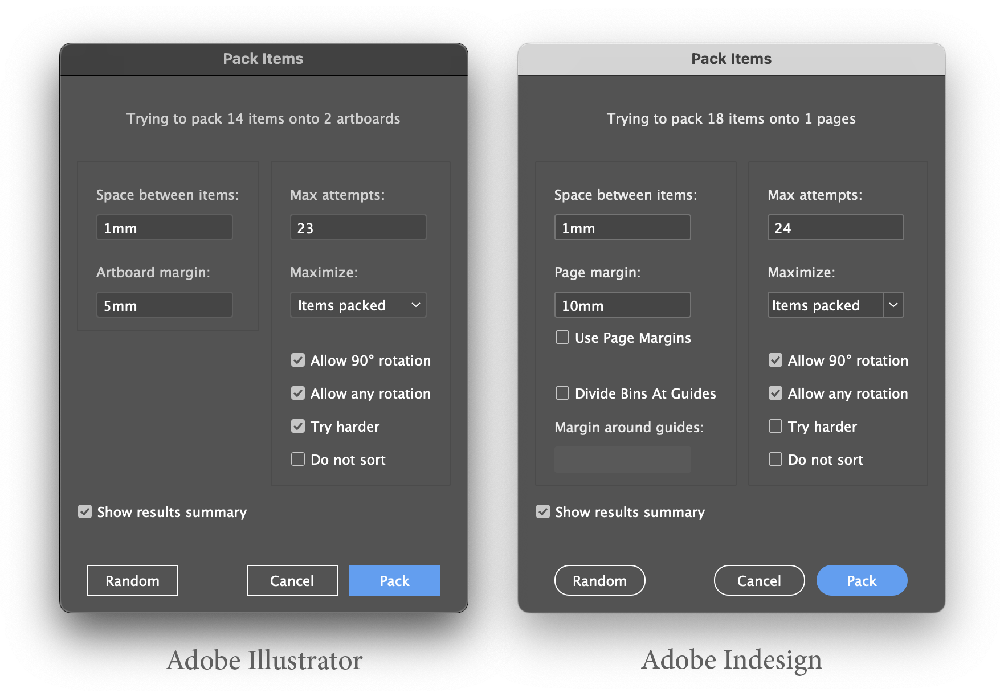

# Bin Packing For Illustrator and Indesign

Scripts that perform 2D bin packing on Adobe Illustrator artboards and Adobe Indesign pages, automating the process of arranging selected page items into artboards or pages, with the aim of achieve a reasonably tight packing.

## Show your support

If this project will save you time, please consider supporting me:

---

## Installation

### Step 1: Download the Scripts

Download script files (zipped):

The repository contains the following script files:

- `Bin Packing--Artboards.js` (for Adobe Illustrator)
- `Bin Packing--Pages.js` (for Adobe InDesign)
- `Packer.js` (required helper script)
- `packer-blocks.js` (required helper script)

> Note: Ensure that `Packer.js` and `packer-blocks.js` are located in the same directory as the main script you want to run.

#### Step 2: Place the Scripts in the Appropriate Folder

Move the downloaded files to your Adobe application's ExtendScript folder.

See [How To Install Scripts in Adobe Illustrator](https://creativepro.com/how-to-install-scripts-in-adobe-illustrator) and [How To Install Scripts in Adobe Indesign](https://creativepro.com/how-to-install-scripts-in-indesign).

#### Step 3: Run the Script

1. Open your Adobe Illustrator or InDesign application.
1. Add artboards or pages as needed. The script will try to pack the items into these "bins". If you do not have enough bins, the script may not find a solution.
1. Select the items you want to pack.
1. Open the `Scripts` panel from `Window > Utilities > Scripts` (InDesign) or from the `File > Scripts` menu (Illustrator).
1. Choose either `Bin Packing--Artboards.js` or `Bin Packing--Pages.js` to execute the script.

---

## Usage

1. **Prepare your document:** Open an Adobe InDesign document and select the items you wish to pack.

1. **Run the script:** Execute the script, which will pack your selected items onto the available pages.

1. **Options:**
   - **Space between items:** The space between packed items.
   - **Margin:** The space between packed items and the bin's outer edges.
   - **Divide Bins at Guides:** (Indesign only) Whether to use guides in the document to split pages into multiple bins.
   - **Maximum attempts:** The number of attempts to make before giving up. Note: the script will only reach this maximum if no packing has been successful, or if `Try harder` is enabled.
   - **Try Harder:** Whether to continue testing new attempts even after all items are successfully packed. Do this if you are looking for a better packing result.
   - **Random Packing:** Perform a single random-shuffle packing for an aesthetic or experimental result.
   - **Custom Scoring:** Choose to prefer either packing more items or maximizing the packed area.
   - **Allow rotation** Allow items to be rotated by 90° during packing.

---

## Author

Created by Mark Bean ("[m1b](https://community.adobe.com/t5/user/viewprofilepage/user-id/13791991)"), inspired by [this community discussion](https://community.adobe.com/t5/illustrator-discussions/how-to-organize-multiple-different-objects-on-one-sheet-with-a-defined-gap-inbetween-them/m-p/12475475). The scripts rely on the 2D bin packing algorithm shared by Trentium (see acknowledgements below).

## Acknowledgements

The 2D bin packing algorithm is by Stackoverflow user [trentium](https://stackoverflow.com/users/7696162/trentium) published [here](https://stackoverflow.com/questions/56642111/bin-packing-js-implementation-using-box-rotation-for-best-fit) and for which I am very grateful.

I also acknowledge Adobe community forum user "MarioRossiGD" for support the development of the Indesign version of the original script.

## License

This project is open-source and available under the MIT License. See the [LICENSE](LICENSE) file for details.
